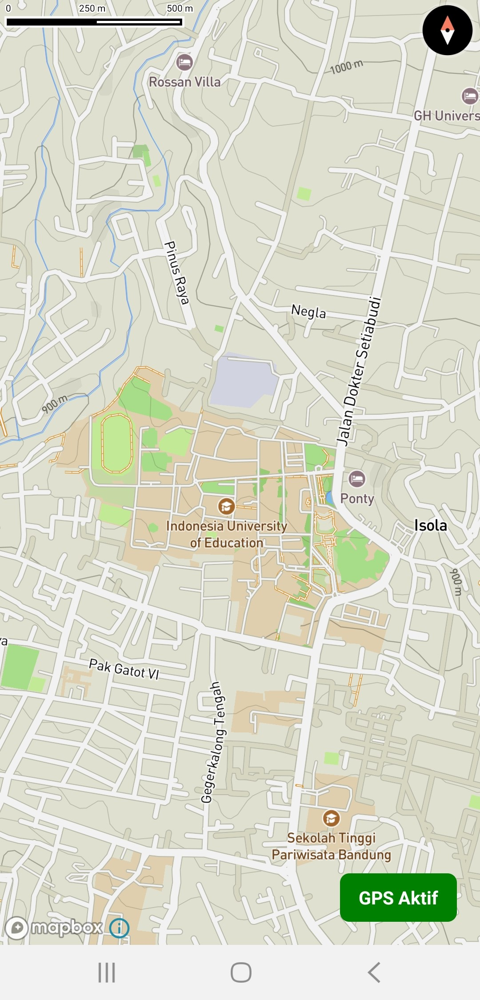
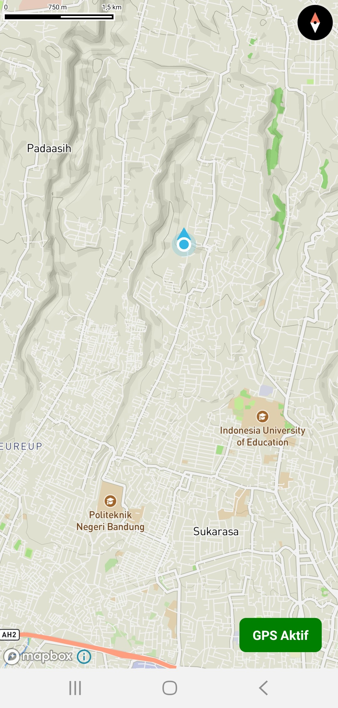

# Mapbox di React Native - Inisiasi

Project React Native ini menggunakan @rnmapbox/maps untuk menampilkan peta dan menggunakan GPS. Project ini dikonfigurasi untuk menggunakan download token dari `gradle.properties` dan access token dari file `.env`. Pastikan untuk menggunakan Token didapat dari Mapbox.

## Contoh Gambar

|  |  |
| ---------------------------------------------- | ---------------------------------------------- |

## Prasyarat

Pastikan telah menginstal Node.js dan React Native CLI di komputer sebelum memulai. Sudah mengerti mempersiapkan project seperti android sdk dan menggunakan React Native CLI, juga sudah membaca repositori dari @rnmapbox/maps.

Proyek ini hanya dijalankan untuk android.

## Panduan Penggunaan

Ikuti langkah-langkah di bawah ini untuk menjalankan proyek ini di lingkungan pengembangan kamu:

1. Clone repositori ini ke direktori lokal:

   ```bash
   git clone https://github.com/realiyams/MapboxReactNativeInit.git
   ```
2. Buka terminal dan pindah ke direktori proyek:

   ```bash
   cd MapboxReactNativeInit
   ```
3. Instal semua dependensi dengan menjalankan perintah berikut:

   ```bash
   npm install
   ```
4. di file `gradle.properties` di direktori android, masukkan download token Mapbox di akhir file:

   ```makefile
   MAPBOX_DOWNLOAD_TOKEN=your_mapbox_download_token
   ```
5. ubah file `sample.env`  menjadi `.env` di direktori proyek dan masukkan access token Mapbox:

   ```makefile
   ACCESS_TOKEN=your_mapbox_access_token
   ```
6. Jalankan aplikasi dengan menjalankan perintah berikut:

   ```bash
   npx react-native run-android
   ```

Ini akan menjalankan aplikasi React Native di simulator atau perangkat yang terhubung.
